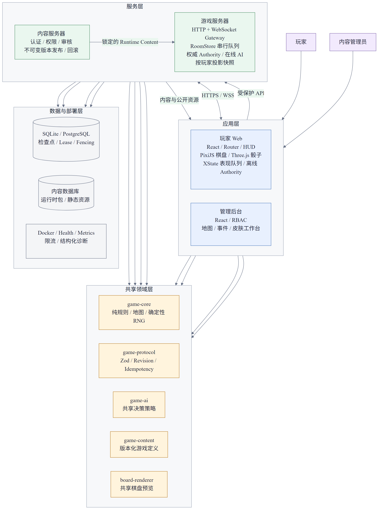
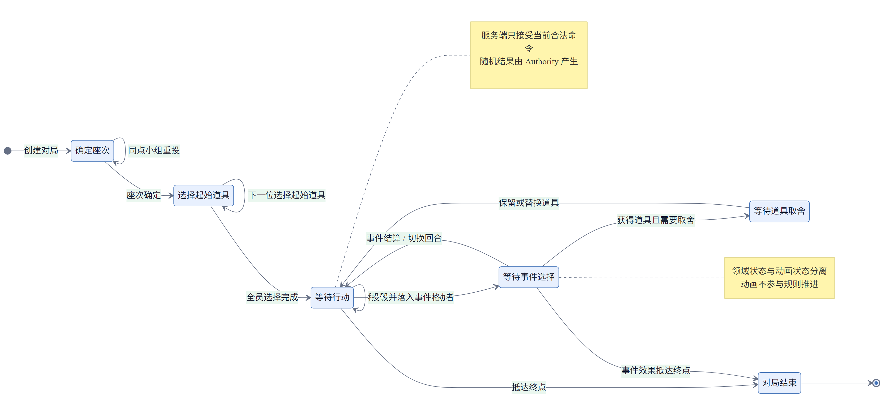
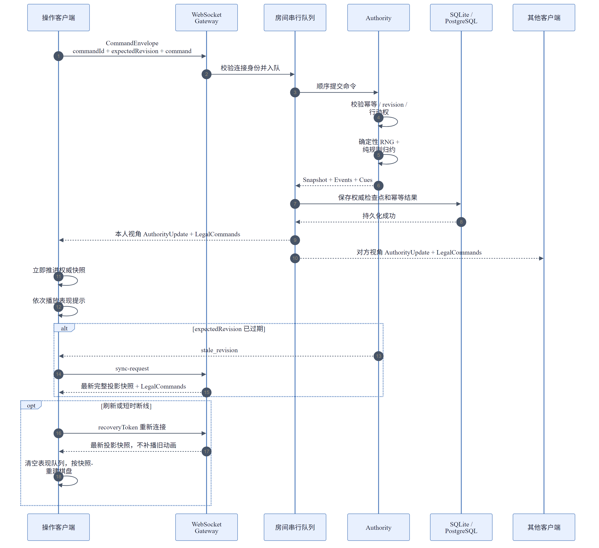

# 鹅了个棋｜面试问题准备

更新日期：2026-08-11

## 1. 一分钟项目介绍

### 参考回答

“鹅了个棋”是我主导设计并通过 AI 协作开发的全栈多人联机 Web 棋盘游戏。它支持 65 格地图、离线人机以及 2 至 4 人真人和 AI 混合联机。

我没有把规则直接写在 React 或 PixiJS 组件里，而是抽出纯 TypeScript 规则内核。玩家、AI 和远程客户端都提交同一种命令，由 Authority 产生确定性随机结果，并输出新状态、领域事件和动画提示。

联机采用服务端权威模型，通过 commandId 保证幂等，通过 revision 防止基于旧状态操作，并按房间串行执行命令。客户端把权威状态和动画表现分开，所以动画慢、页面失焦或短时断线不会阻塞其他玩家。

项目还包含 SQLite/PostgreSQL 房间恢复、内容版本锁定以及地图、事件、皮肤管理后台。AI 主要用于代码检索、局部实现和测试补充，我负责需求边界、领域模型、架构决策、安全审查和最终验收。

## 2. 系统架构

### 2.1 为什么使用 Monorepo？

**参考回答：**

客户端和服务端需要共享命令、快照、规则及内容类型。如果分别维护，很容易出现协议和规则版本漂移。Monorepo 可以让 `game-core`、`game-protocol`、`game-ai` 和 `game-content` 被多个应用直接复用，并通过 TypeScript 与包边界检查在构建期发现不一致。

Monorepo 不是为了把所有代码混在一起。项目仍通过 workspace 包限制依赖方向，例如 `game-core` 不依赖 React、WebSocket 或数据库，应用层可以依赖领域包，领域包不能反向依赖应用。

**可能追问：为什么不用共享一个 `types.ts`？**

共享类型只能解决编译期问题，网络数据仍然是不可信输入。因此协议包同时提供 Zod 运行时 schema、协议版本和 TypeScript 推导类型。

### 2.2 为什么规则层必须是纯 TypeScript？

**参考回答：**

同一套规则需要被离线客户端、在线服务器、AI、模拟程序和单元测试使用。规则层不依赖 UI、网络和数据库后，可以使用固定种子重放，也能验证相同状态和命令必然产生相同结果。

规则函数本质上接收当前状态、游戏定义、玩家和命令，返回新状态、领域事件及表现提示，不直接操作 Canvas、DOM 或 WebSocket。

### 2.3 `State`、`DomainEvent` 和 `PresentationCue` 为什么要同时存在？

**参考回答：**

- `State` 表示最终权威事实，用于显示、恢复和下一条命令校验。
- `DomainEvent` 描述业务上发生了什么，例如投骰、碰撞或回合切换，可用于日志、审计和解释。
- `PresentationCue` 描述结果应该如何展示，例如原始骰面、修正后的骰面、移动路径和碰撞动画。

只发送事件会让断线恢复复杂；只发送快照又无法自然播放连续动画。因此采用快照保证正确、事件表达语义、Cue 驱动表现。

**风险点：** 不要把当前实现描述成完整 Event Sourcing。恢复以最新快照和 Authority 检查点为主。

## 3. 游戏状态与交互

### 3.1 游戏有哪些核心状态？

**参考回答：**

核心状态包括确定座次、选择起始道具、等待行动、等待事件选择、等待道具取舍和游戏结束。每个状态只允许有限命令，例如等待行动时才能使用主动道具或请求移动骰，等待事件选择时只能选择服务端提供的事件。

状态机的价值在于把“不允许发生什么”也明确表示出来，避免按钮隐藏了但接口仍可非法调用的问题。最终合法性由 Authority 再次校验。

### 3.2 用户点击“投骰”之后发生什么？

**参考回答：**

1. React 根据服务端下发的 `legalCommands` 判断当前是否允许投骰。
2. 客户端只提交 `request-roll`，不提交骰子点数。
3. 服务端校验身份、revision、当前行动者和阶段。
4. 规则引擎使用权威 RNG 产生骰子，处理道具修正、移动、碰撞、事件和胜负。
5. 服务端持久化新检查点，再广播按玩家裁剪的更新。
6. 客户端立即保存权威快照，然后播放骰子和棋子移动动画。

### 3.3 为什么在线 UI 依赖 `legalCommands`？

**参考回答：**

如果客户端自己复制“现在轮到谁、可以选谁、哪些道具可用”的规则，前后端会产生双重事实源。服务端为每个玩家计算合法命令，客户端只是将其映射为控件和目标列表，从而降低规则漂移和越权入口。

客户端的禁用按钮只是体验优化，安全边界仍在服务端。

## 4. 联机同步与一致性

### 4.1 为什么采用服务端权威，而不是客户端同步位置？

**参考回答：**

骰子、抽卡、移动和碰撞都会影响胜负。如果客户端上传骰子点数或最终位置，就很难防止作弊，也容易因不同客户端计算差异产生分叉。项目让客户端只提交意图，所有随机和结算均由服务端 Authority 产生。

### 4.2 如何防止重复投骰？

**参考回答：**

每次操作都有唯一 `commandId`。Authority 保存已经处理的命令和结果：

- 同一 ID、同一载荷重复到达时返回原结果，不重复执行。
- 同一 ID 携带不同载荷时返回 `duplicate_command`。
- 持久化检查点同时保存幂等结果，因此进程重启后仍能识别已处理命令。

这解决的是“至少一次传输”下的业务幂等问题，而不是假设 WebSocket 永远只发送一次。

### 4.3 `expectedRevision` 解决什么问题？

**参考回答：**

它表示客户端命令基于哪个权威版本。如果服务器当前 revision 已推进，普通旧命令会被拒绝为 `stale_revision`，客户端再请求最新快照。

这是一种乐观并发控制。它防止用户在旧事件卡、旧行动者或旧道具状态上继续操作。房间串行队列保证写入顺序，revision 负责判断命令上下文是否仍然有效。

**可能追问：为什么既需要队列又需要 revision？**

队列解决服务端内部并发写入顺序；revision 解决客户端命令是否基于过期状态。两者处理的是不同问题。

### 4.4 为什么持久化成功后才广播？

**参考回答：**

如果先广播、后持久化，而数据库保存失败或进程崩溃，客户端看到的状态会领先于可恢复状态。项目先保存 Authority 检查点和幂等缓存，再向客户端广播，使外部可见状态不超过持久化状态。

严格来说，这还不是数据库与网络的分布式事务；客户端仍应按 revision 去重，并能通过完整同步恢复。

### 4.5 客户端如何处理重复或乱序更新？

**参考回答：**

客户端以 snapshot revision 为顺序依据，只将更高 revision 的 AuthorityUpdate 加入表现队列。完整 `room-state` 或重连快照会清空旧表现更新，直接重建棋盘。命令结果与广播更新分开处理，不能假设两者固定按某个网络顺序到达。

### 4.6 为什么有权威快照和表现快照两份状态？

**参考回答：**

权威快照在网络消息到达后立即更新，用于 revision 和下一条命令；表现快照在动画播放完成后才更新 HUD 和棋盘。这样服务器不用等待客户端动画，某个客户端卡顿也不会拖慢整局游戏。

如果动画抛错、页面失焦或超过保护时间，客户端直接同步到该更新的权威快照，然后继续消费后续更新。

## 5. 断线恢复与隐私

### 5.1 刷新页面如何恢复原座位？

**参考回答：**

创建或加入房间时，服务端返回稳定 `playerId` 和恢复凭证。凭证保存在标签页的 sessionStorage，重连时通过它绑定原座位。服务端只持久化凭证的 SHA-256 摘要，不保存明文。

重连后服务端发送最新完整投影快照和合法命令，不补发断线期间的旧动画。客户端清空表现队列，并按快照重建 UI 和棋盘。

### 5.2 多标签页关闭一个为什么不能立即判定掉线？

**参考回答：**

服务器为成员记录连接数。只有最后一条连接断开才进入重连宽限期，因此关闭一个标签页不会错误地把仍在线的玩家标记为离线。

### 5.3 玩家掉线后如何避免整局停住？

**参考回答：**

真人玩家获得默认 30 秒恢复窗口。超时后，进行中的对局可以把该座位控制器切换为 AI，并由同一个房间队列继续提交命令。如果掉线者是房主，还会将房主权限转给最早入座且在线的真人。

### 5.4 如何避免泄露其他玩家的隐藏信息？

**参考回答：**

服务器不直接广播同一份完整快照，而是按查看者投影：其他玩家的道具置空，私有候选和待确认内容只发给本人，私有事件不广播，真实 RNG 种子及游标不发给浏览器，同时每人只收到自己的合法命令。

前端隐藏字段不等于安全；必须在服务端发送前完成裁剪。

## 6. 随机数与可恢复性

### 6.1 如何保证随机结果可以重放？

**参考回答：**

GameState 保存 RNG 的 seed 和 cursor。规则命令通过确定性随机源消费随机数，归约完成后把新 cursor 写回状态。同一游戏定义、初始状态和命令序列会得到相同结果。

在线客户端看不到真实 seed 和 cursor，防止玩家预测后续骰子或事件；它们只存在于完整权威快照中。

### 6.2 为什么不能调用 `Math.random()`？

**参考回答：**

`Math.random()` 无法可靠保存进度和重放，测试也很难稳定复现。如果随机过程没有进入权威状态，服务器重启后无法保证后续序列与中断前一致。

## 7. SQLite、PostgreSQL 与多实例

### 7.1 SQLite 和 PostgreSQL 分别解决什么问题？

**参考回答：**

SQLite 适合单实例部署，配置简单，并通过 WAL 和同步落盘支持房间及 Authority 检查点恢复，但不能把多个游戏服务器同时当作写入者。

PostgreSQL 模式用于多实例。房间记录包含 owner、租约期限和单调递增 fencing token，只有当前 owner 且 token 匹配的实例才能保存或续租。

### 7.2 为什么只有租约还不够，还需要 fencing token？

**参考回答：**

旧实例可能因为长时间暂停或网络分区，以为自己仍然持有房间。即使租约已经转移，它恢复执行后仍可能发起旧写入。单调递增的 fencing token 让数据库识别并拒绝旧 owner 的写入，避免两个实例交替覆盖房间状态。

### 7.3 这是不是强一致分布式系统？

**参考回答：**

不应泛化为完整的通用分布式一致性方案。这里解决的是以 PostgreSQL 为协调点的“单房间单写者”问题。数据库不可用时房间不能继续安全提交，系统选择停止写入而不是冒险产生双 Authority。

## 8. 前端渲染与表现队列

### 8.1 React、PixiJS 和 Three.js 如何分工？

**参考回答：**

React 负责路由、大厅、HUD、卡牌和弹窗等声明式 UI；PixiJS 管理棋盘、棋子、路径和镜头等高频 2D 场景对象；Three.js 只负责透明画布中的 3D 骰子。三者消费同一份表现更新，但都不决定规则结果。

### 8.2 为什么不直接让 React 渲染所有棋盘对象？

**参考回答：**

棋盘包含持续补间、镜头移动、精灵动画和 ticker 更新，使用 PixiJS 的场景树更合适。React 只管理 PixiJS 容器的创建和销毁，避免 React 重渲染参与每帧更新。

### 8.3 XState 在项目里负责什么？

**参考回答：**

XState 管理表现阶段：ready、rolling、routePreview、targetEmphasis、routeFade、moving。它确保骰子结束后才能预览路线，路线和目标提示完成后才开始移动。

领域规则状态仍由 `game-core` 管理，不能把表现状态机说成游戏权威状态机。

## 9. 内容平台与版本管理

### 9.1 为什么内容发布后要不可变？

**参考回答：**

如果管理员修改事件或地图后直接影响正在进行的房间，同一 revision 的规则含义会发生变化，重启恢复和争议重放也会失效。项目在开房时锁定 `contentVersion`、`mapVersion` 和 `rulesetVersion`，后续发布只影响新房间。

### 9.2 为什么管理后台要复用正式棋盘渲染器？

**参考回答：**

如果后台单独实现一套预览，地图坐标、标记和路线规则容易与玩家端不一致。共享 `board-renderer` 可以让内容编辑预览与正式运行时使用相同定义和坐标语义。

### 9.3 RBAC 只在前端隐藏按钮够吗？

**参考回答：**

不够。前端守卫只改善体验，内容服务器必须对每个受保护 API 校验会话和角色，否则调用者可以绕过页面直接请求发布或回滚接口。

## 10. AI 协作

### 10.1 这个项目里 AI 实际做了什么？

**参考回答：**

AI 用于阅读仓库、检索影响范围、比较方案、实现局部功能、补充测试、分析失败和同步文档。我负责定义需求、领域模型、包边界、服务端信任模型、验收条件，并审查 AI 的修改是否符合产品和安全要求。

### 10.2 如何避免 AI 修改失控？

**参考回答：**

- 用规格文档定义产品与技术基线。
- 每次任务要求先检查 Git、实际代码和相关测试。
- 用仓库级指令限制依赖边界、修改范围和验证命令。
- 将需求拆成可验收的小提交，而不是一次生成整个系统。
- 修改后执行类型检查、Lint、单元测试和风险相关 E2E。
- 跨会话使用交接 Prompt，但始终以仓库和 Git 状态为准。

### 10.3 如何证明你不是只会让 AI 生成代码？

**参考回答：**

我可以解释为什么采用服务端权威、revision 和队列分别解决什么问题、为什么持久化必须先于广播、为什么恢复凭证只能存摘要，以及 lease 为什么还需要 fencing token。这些架构和安全取舍需要开发者承担责任。AI 可以协助实现，但不能代替对系统正确性的理解。

### 10.4 AI 生成代码出现过什么问题？

**参考回答：**

典型问题包括规格和实际协议版本漂移、测试夹具未随规则变化更新、局部修改复制已有判断，以及 UI 测试依赖固定随机种子导致内容变化后失效。处理方式是以代码和协议 schema 为事实来源，定位失败属于实现回归还是测试假设过期，再同步代码、测试和文档。

回答时可以结合当前协议 v13 与部分规格仍写 v12，以及当前 5 项失败测试，说明自己不会把 AI 输出或旧文档当作未经验证的事实。

## 11. 测试与质量

### 11.1 项目如何测试？

**参考回答：**

- `game-core`：规则边界、碰撞、终点、道具和固定随机种子。
- `game-protocol`：Schema 校验、JSON 往返、幂等、过期 revision 和快照恢复。
- `game-server`：房主权限、房间流程、持久化、重启恢复和 owner lease。
- React 组件：合法操作、事件选择、表现队列和异常恢复。
- Playwright：双客户端建房、加入、准备、开局、刷新恢复，以及 Chromium、Firefox、WebKit 和延迟链路。

### 11.2 如果测试失败，你如何判断是产品 Bug 还是测试过期？

**参考回答：**

先回到规格和领域不变量，再检查实际状态转移。若行为违反不变量，例如相同命令执行两次，就是实现问题；若产品已明确允许并发开局操作，而旧测试仍要求 stale revision，则是测试假设需要更新。不能为了让测试变绿直接修改断言，也不能只凭新实现反推需求。

## 12. 项目不足与改进方向

### 12.1 当前项目还有哪些不足？

建议主动回答：

- 当前全量测试仍有 5 项失败，需要区分最近规则调整后的测试漂移与真实回归。
- 部分规格仍记录协议 v12，而代码已经是 v13，需要建立自动版本一致性检查。
- 恢复凭证是游客房间身份，不等同于完整账号认证体系。
- 当前 PostgreSQL 方案解决单房间单写者，但还需要部署层数据库高可用、集中告警和故障演练。
- 暂无公开匹配、观战、排行榜和跨局成长，这些是明确未进入当前范围的能力。

### 12.2 下一步会优先做什么？

**参考回答：**

第一优先级是恢复测试门禁并消除协议文档漂移；随后补充持久化失败、租约切换和表现超时的故障注入测试。功能层面再考虑账号体系或公开匹配，避免在基础可靠性未稳定时扩大产品范围。

## 13. 面试前必须核对

1. 修复或明确解释当前 5 项失败测试，重新执行 `npm test`。
2. 执行 `npm run typecheck`、`npm run lint` 和关键 Playwright E2E。
3. 将规格中的协议 v12 更新为代码实际使用的 v13。
4. 准备现场展示路径：离线开局、创建联机房间、第二客户端加入、刷新恢复、管理后台预览。
5. 熟悉以下关键代码：

   - [游戏状态与命令](../packages/game-core/src/types.ts)
   - [纯规则归约](../packages/game-core/src/rules.ts)
   - [协议 Schema](../packages/game-protocol/src/schemas.ts)
   - [Authority 幂等与 Revision](../packages/game-protocol/src/local-authority.ts)
   - [房间队列与广播](../apps/game-server/src/room-store.ts)
   - [客户端重连与同步](../apps/web/src/OnlineRoomPage.tsx)
   - [在线表现队列](../apps/web/src/OnlineMatchStage.tsx)
   - [表现状态机](../apps/web/src/game-client/machine/presentation-machine.ts)

6. 准备承认项目边界，不要把领域事件描述成完整 Event Sourcing，也不要把租约方案泛化成通用分布式一致性系统。
